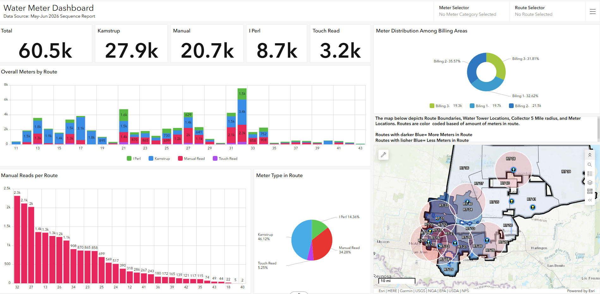

# Automatic-Meter-Read-AMR-Deployment-Optimization-Analysis-for-Water-Utilities
Developed a spatial decision-support framework to optimize Automatic Meter Read (AMR) deployment by identifying routes and service areas with the greatest potential for successful conversion to automated meter reading.

---

## Executive Summary

Using Excel, ArcGIS, and ArcGIS Dashboards, I analyzed the existing distribution of Automatic Meter Reading (AMR) infrastructure to identify opportunities for expanding remote meter reading capabilities across the utility's service area. By evaluating meter types, meter concentrations by route, collector tower locations, and collector communication ranges, I developed an interactive dashboard to visualize coverage gaps and assess which geographic areas would benefit most from meter conversions. The analysis provided a data-driven framework for prioritizing AMR deployment efforts, supporting infrastructure planning, improving operational efficiency, and reducing the need for manual meter reading.

---
## AMR Deployment Dashboard

The dashboard was developed to support strategic planning for future AMR deployments by visualizing collector coverage, meter distributions, and route-level conversion opportunities across the utility's service area. By integrating meter classifications, billing routes, and collector service ranges, the analysis enabled leadership to identify areas where AMR implementation would provide the greatest operational benefit and maximize the value of existing infrastructure investments.

---

## Business Problem

Transitioning from manual meter reading to Automatic Meter Reading (AMR) required balancing operational efficiency with infrastructure costs. Utility leadership needed a data-driven way to identify where AMR expansion would provide the greatest benefit by prioritizing routes, leveraging existing collector coverage, and targeting areas with high concentrations of non-AMR meters

---

## Methodology

1.	Prepared and enriched meter inventory data in Excel by assigning meter types to existing meter records.
2.	Used ArcGIS Pro to perform buffer analysis around collector tower locations to identify meters within communication range.
3.	Aggregated meter counts by route and meter type to identify areas with high concentrations of non-AMR meters.
4.	Developed an ArcGIS Dashboard to visualize collector coverage, meter distributions, and route-level metrics to support deployment planning.
5.	Identified priority areas for future AMR expansion by combining collector coverage, route characteristics, and meter concentrations.

---

## Skills

•  ArcGIS Pro & ArcGIS Online 
•  ArcGIS Dashboards 
•  Spatial Analysis 
•  Buffer Analysis 
•  Feature Services 
•  Dashboard Development 
•  Interactive Filtering 
•  Microsoft Excel 
•  Data Preparation & Validation 
•  Meter Classification 
•  Coverage Analysis 
•  Deployment Optimization 
•  Route Prioritization 
•  Infrastructure Planning 

---

## Results & Business Recommendations

Developing an interactive dashboard provided utility stakeholders with visibility into existing AMR infrastructure, collector coverage, and meter distributions across the service area. By democratizing this information, decision-makers were able to evaluate AMR deployment opportunities using objective operational data rather than assumptions.
The analysis revealed that Routes 32 and 33 represented the strongest candidates for the next phase of mass meter replacements. These two routes accounted for more than 50% of the meters within the targeted billing area, and approximately 90% of both route areas fell within the existing 5-mile communication radius of collector towers. This indicated that a large portion of meters could be converted to AMR technology while maximizing the use of existing infrastructure and minimizing the need for additional collector investments.
Based on these findings, the following recommendations were developed:
1.	Prioritize Routes 32 and 33 during the next mass meter replacement initiative to maximize the impact of AMR deployment efforts.
2.	Convert eligible non-AMR meters already located within existing collector coverage areas before investing in additional collector infrastructure.
3.	Continue using the dashboard as a planning tool to identify future deployment opportunities as collector networks expand and meter inventories change.
4.	Evaluate routes with lower collector coverage separately to determine whether future collector installations would support broader AMR adoption.
